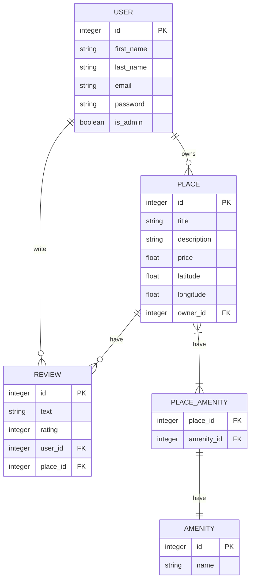

# 🐇 HBnB Evolution part3: Enhanced Backend with Authentication and Database Integration 🐇

Welcome to Part 3 of the HBnB Project, where you will extend the backend of the application by introducing user authentication, authorization, and database integration using SQLAlchemy and SQLite for development.In this part, you will secure the backend, introduce persistent storage, and prepare the application for a scalable, real-world deployment.
## 📘 Objectives of the project

    0. Authentication and Authorization: Implement JWT-based user authentication using Flask-JWT-Extended and role-based access control with the is_admin attribute for specific endpoints.

    1. Database Integration: Replace in-memory storage with SQLite for development using SQLAlchemy as the ORM and prepare for MySQL or other production grade RDBMS.

    2. CRUD Operations with Database Persistence: Refactor all CRUD operations to interact with a persistent database.

    3. Database Design and Visualization: Design the database schema using mermaid.js and ensure all relationships between entities are correctly mapped.

    4. Data Consistency and Validation: Ensure that data validation and constraints are properly enforced in the models.
## 📂 Structure of part3

    0. Modify the User Model to Include Password: You will start by modifying the User model to store passwords securely using bcrypt2 and update the user registration logic.

    1. Implement JWT Authentication: Secure the API using JWT tokens, ensuring only authenticated users can access protected endpoints.

    2. Implement Authorization for Specific Endpoints: You will implement role-based access control to restrict certain actions (e.g., admin-only actions).

    3. SQLite Database Integration: Transition from in-memory data storage to SQLite as the persistent database during development.

    4. Map Entities Using SQLAlchemy: Map existing entities (User, Place, Review, Amenity) to the database using SQLAlchemy and ensure relationships are well-defined.

    5. Prepare for MySQL in Production: Towards the end of this phase, you’ll configure the application to use MySQL in production and SQLite for development.

    6. Database Design and Visualization: Use mermaid.js to create entity-relationship diagrams for your database schema.
## ✅ Expected outcome for each task

    0. Functional Application Factory that can handle different configurations.

    1. The User model will securely hash and store passwords using bcrypt.
        The POST /api/v1/users/ endpoint will accept passwords and securely hash them before storing. Passwords will not be returned in any GET requests.

    2.  Implemented user login functionality using JWT.
        They will be able to generate and verify JWT tokens, protect specific API endpoints, and embed claims (like is_admin) within the token for future authorization checks.

    3. The following endpoints will be secured, allowing only authenticated users to perform actions based on their ownership of places and reviews:
        - Create, update, and delete places (with ownership checks).
        - Create and update reviews (with restrictions on reviewing owned places and duplicate reviews).
        - Modify user details (excluding email and password).

    4. Admins will be able to:
        - Create new users. - Modify any user’s data, including email and password (with validation for unique emails).
        - Add and modify amenities.
        - Bypass ownership restrictions on places and reviews.

    5. Implemented the SQLAlchemyRepository and refactored the Facade to use this new repository for data persistence.

    6. The User entity will be fully mapped to a SQLAlchemy model, and the repository pattern will be updated to interact with the database using SQLAlchemy.
        You will have refactored the Facade to use the new UserRepository, and the application will now store user data in the database persistently.

    7. Mapped the Place, Review, and Amenity entities to SQLAlchemy models, ensuring that their basic attributes are stored in the database.
        The repositories and facade methods should be updated to handle CRUD operations for each entity.

    8. Successfully mapped the relationships between entities using SQLAlchemy.
        These relationships will ensure data integrity and allow efficient querying of related data, enabling complex operations such as retrieving all reviews for a place or all places owned by a user.
        The correct use of relationship(), backref, and foreign keys will establish clear, bidirectional links between your entities.

    9. SQL scripts that generate the full database schema.
        Inserted an administrator user and amenities into the database.
        Tested CRUD operations to verify correct functionality of the schema and data.

    10. Created an ER diagram in Mermaid.js that accurately represents the database schema for HBnB.
        Understood the various types of relationships (one-to-many, many-to-many) and how they are represented visually.
        Exported the diagram to be included in your project documentation.
## Database ER Diagram

